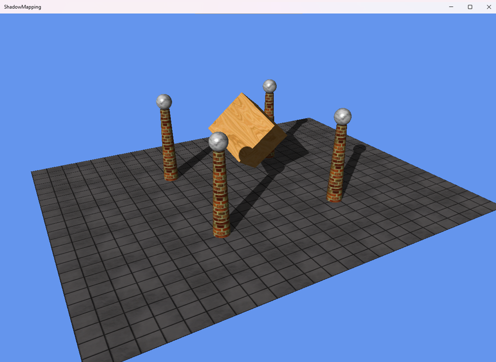

# DemoApps

## Shadow Mapping

The [ShadowMapping](https://github.com/ata6502/DemoApps/tree/main/ShadowMapping) demo implements the shadow mapping algorithm as 
described in the Frank Luna's [book](https://www.amazon.ca/Introduction-3D-Game-Programming-DirectX/dp/1936420228).

## Boids

The [SimpleBoids](https://github.com/ata6502/DemoApps/tree/main/SimpleBoids) demo implements the [boids flocking algorithm](https://www.red3d.com/cwr/boids/).

## Resources

The following resources where particularly useful while creating the demos:

* Boids pseudocode: http://www.kfish.org/boids/pseudocode.html
* Boids in JavaScript: https://github.com/beneater/boids/blob/master/boids.js
* Direct3D rendering book: Frank Luna (2012) "Introduction to 3D Game Programming with DirectX 11", Mercury Learning & Information

## How to build with Visual Studio 2022 on Windows 10/11

* In Visual Studio Installer, check the Windows application development workload to include Universal Windows platform tools.
* In the Installation details, check the C++ (v143) Universal Windows platform tools.
* Open the DemoApps.sln solution file and set the Target Platform Version of the projects. Currently, the version is set to 10.0.22621.0 which targets Windows 11.
