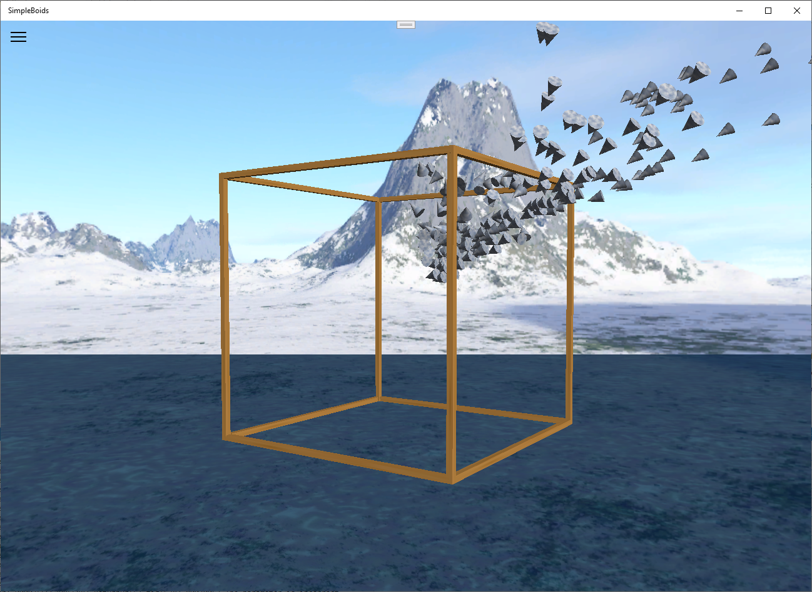

# DemoApps

## ShadowMapping

The [ShadowMapping](https://github.com/ata6502/DemoApps/tree/main/ShadowMapping) implements a simple scene that employs
the shadow mapping algorithm as decribed in the Frank Luna's [book](https://www.amazon.ca/Introduction-3D-Game-Programming-DirectX/dp/1936420228).

## SimpleBoids

The [SimpleBoids](https://github.com/ata6502/DemoApps/tree/main/SimpleBoids) implements the [boids flocking algorithm](https://www.red3d.com/cwr/boids/).

The following resources where particularly useful while creating this demo:

* Boids pseudocode: http://www.kfish.org/boids/pseudocode.html
* Boids in JavaScript: https://github.com/beneater/boids/blob/master/boids.js
* Direct3D rendering book: Frank Luna (2012) "Introduction to 3D Game Programming with DirectX 11", Mercury Learning & Information

