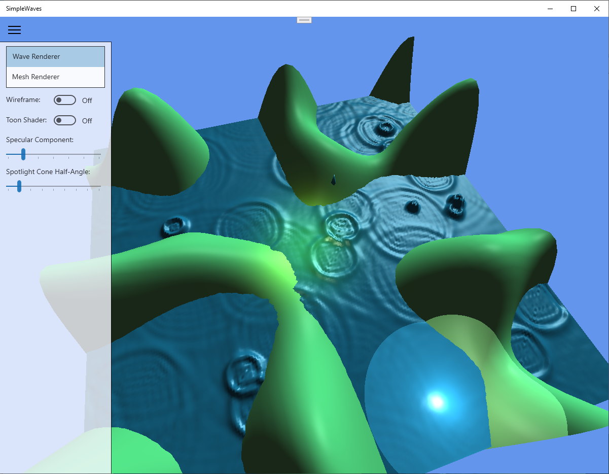
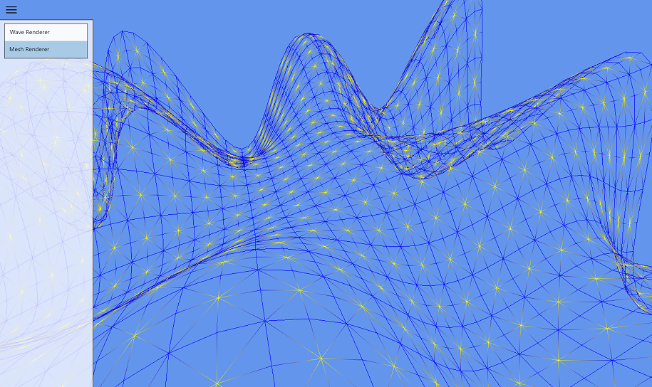
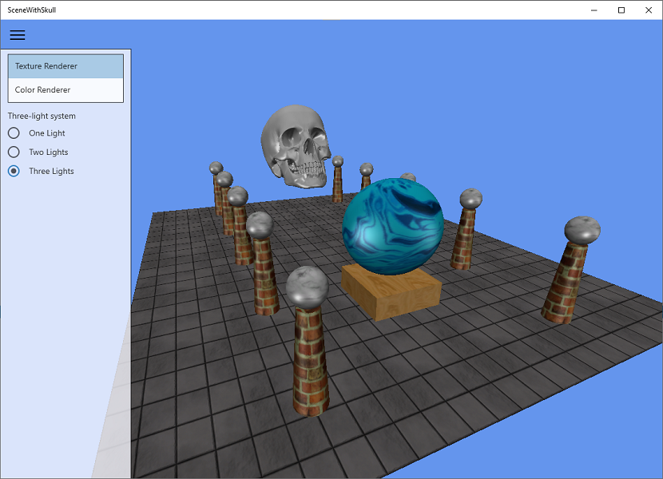

# DemoApps
This repository contains examples of simple UWP (Universal Windows Platform) applications 
using [Direct3D 11](https://docs.microsoft.com/en-us/windows/win32/direct3d11/atoc-dx-graphics-direct3d-11), 
[WinRT/C++](https://docs.microsoft.com/en-us/windows/uwp/cpp-and-winrt-apis/), 
and XAML. So far, there are four demos in the repository:

* `HelloWorld` - A colored rotating cube -- the most basic 3D application.
* `TexturedCube` - A cube with materials and textures, lit by directional lights.
* `SimpleWaves` - A terrain and waves.
* `SceneWithSkull` - A scene built from meshes.

## Hello World

A rotating cube is a canonical example of 3D animation. As simple as it is, the application
requires quite a bit of setup to work properly with XAML and Direct3D:

* The `DeviceResources` class creates both the Direct3D device and the device context as well as the swap chain. It also manages 
the device lost event. 
* The `DemoMain` class loads and executes rudimentary pixel and vertex shaders. It also creates a position/color vertex layout,
vertex and index buffers, a projection matrix.
* The application runs a rendering loop on a worker thread.

## Textured Cube

The `TexturedCube` project extends the Hello World example by introducing the following features:

* Multiple renderers created using a renderer factory:
    + `TextureRenderer` - draws a textured cube lit by two directional lights.
    + `MaterialRenderer` - draws a solid cube lit by a single light.
    + `ColorRenderer` - draws a colored cube whose vertices are transformed dynamically in a vertex shader. Also, it uses 32-bit color values
      (`DirectX::PackedVector::XMCOLOR`) instead of a 128-bit colors.
* XAML control panel allows the user to turn cube rotation on and off as well as select a renderer.
* `IndependentInput` provides means for the user to control the point of view using a mouse.
* Directional lights include diffuse, ambient, and specular components.
* Multiple constant buffers minimize the CPU/GPU traffic.

## Simple Waves

The `SimpleWaves` app: 

* Applies a height function to a grid to create "hills and valleys".
* Utilizes a dynamic vertex buffer to animate waves. The buffer is populated using the `ID3D11DeviceContext2::Map` method.
* Includes a `Waves` class from [Luna] that performs calculations of waves. The code is based on [Lengyel].
* `WaveRenderer` uses three light sources: a fixed directional light, a point light that  circles about the terrain, 
and a spot light that moves with the camera and aims in the direction the camera is looking.

This app could be implemented on the GPU using rendering to texture or the compute shader as well as vertex texture fetch. 
For simplicity, we compute wave simulation on the CPU and update vertices using a dynamic vertex buffer.

## Scene with Skull

The `SceneWithSkull` app builds a scene made of Cube, Pyramid, Cylinder, Sphere, Grid, and Geosphere meshes. It also
loads a skull mesh from a file.

* `DrawIndexed` method draws multiple objects by using a separate world matrix for each object.
* `MeshGenerator` class keeps vertices of all the objects in a single vertex buffer and all indices in a single index buffer.
* `MeshGenerator` creates the following meshes: .
* `ScissorTestController` enables a scissor test that culls pixels that are outside of a scissor rectangle.
* `ThreeLightSystemController`controls the number of directional lights.

# References

Many pieces of code in DemoApps are based on or inspired by the following sources:

* [Luna] Luna, Frank, "Introduction to 3D Game Programming with DirectX 11". Mercury Learning, 2012
* [Lengyel] Lengyel, Eric, "Mathematics for 3D Game Programming and Computer Graphics". Charles River Media, Inc., Boston, MA, 2002.
* Microsoft sample applications - [Simple3DGameDX](https://github.com/microsoft/Windows-universal-samples/tree/main/Samples/Simple3DGameDX/cppwinrt)
